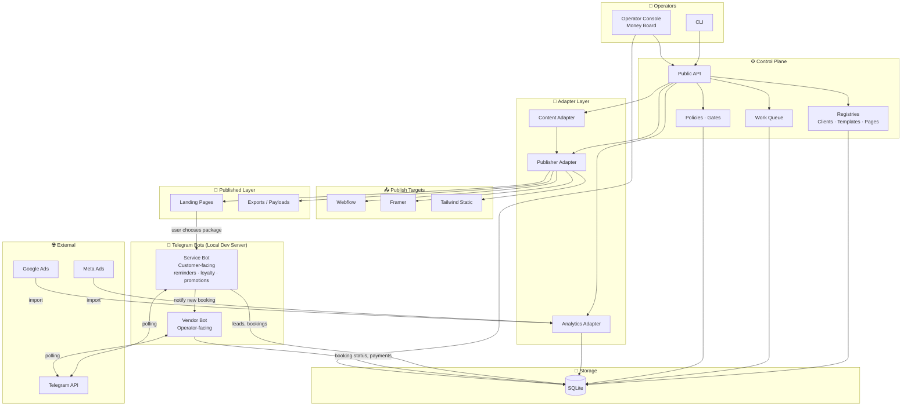
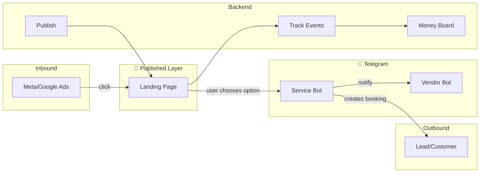

# Acquisition Engine — Infrastructure Diagram

*For any business that sells packaged services and benefits from effective booking management.*

## High-Level Architecture



## Telegram Bot Logic (Service vs Vendor)

```mermaid
flowchart LR
    subgraph Published["📄 Landing Page (Published)"]
        LP[Landing Page]
    end

    subgraph ServiceBot["🛎️ Service Bot (Customer)"]
        PKG[Package deep link<br/>/start package_xxx]
        FLOW[Booking flow<br/>timeslot, confirm]
        CREATE[Create booking]
        NOTIFY[Notify vendor]
        EXTRA[Reminders · loyalty · promotions]
    end

    subgraph VendorBot["⚙️ Vendor Bot (Operator)"]
        CMD[/bookings<br/>/paid /complete]
        RECV[Receives booking<br/>notifications]
    end

    subgraph DB["💾 Database"]
        DBSTOR[(leads, bookings<br/>conversations,<br/>payment_intents)]
    end

    subgraph Users["👥 Users"]
        Customer[Customer]
        Vendor[Vendor / Operator]
    end

    LP -->|"click package"| Customer
    Customer -->|t.me/bot?start=package_xxx| PKG
    PKG --> FLOW --> CREATE --> NOTIFY
    EXTRA -.->|optional| Customer
    CREATE --> DBSTOR
    NOTIFY --> RECV
    RECV --> Vendor
    Vendor -->|"/bookings, /paid"| CMD
    CMD --> DBSTOR
```

## Data Flow (Lead Acquisition)



## Component Overview

| Layer | Components |
|-------|------------|
| **Operators** | CLI, Operator Console, Money Board |
| **Control Plane** | Public API, Registries, Work Queue, Policies |
| **Storage** | SQLite (clients, pages, events, ad_stats, bookings, leads, chat) |
| **Adapters** | Content, Publisher (Webflow/Framer/Static), Analytics |
| **Published Layer** | Landing pages (user chooses package → redirects to Service Bot) |
| **Service Bot** | Customer-facing. Package deep links, booking flow, leads/bookings, notifies Vendor Bot. Supports reminders, loyalty, promotions |
| **Vendor Bot** | Operator-facing. /bookings, /paid, /complete. Receives notifications from Service Bot |
| **External** | Meta Ads, Google Ads, Telegram API |

---

*Render this Mermaid in [mermaid.live](https://mermaid.live) or any Markdown viewer that supports Mermaid to export as PNG/SVG for LinkedIn.*
